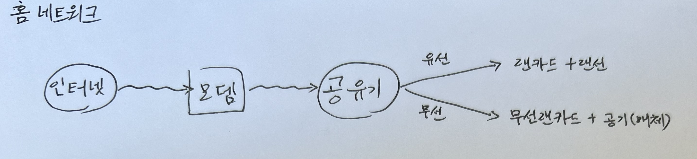
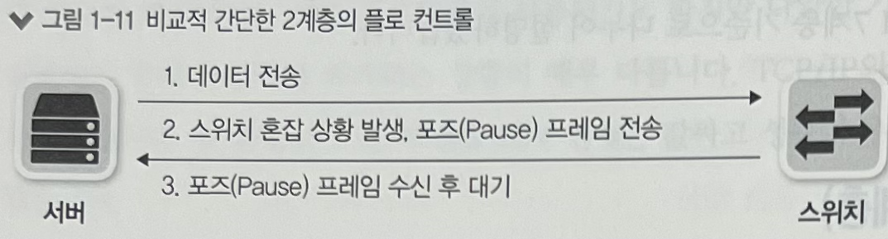

# 네트워크 구성도 살펴보기

## 홈 네트워크 구성

## 데이터 센터 네트워크 구성

`데이터 센터 네트워크 목표` : 안정적이고 빠른 대용량 서비스 제공

`Key Point` : 이중화 기술 + 높은 Bandwidth

# 프로토콜

`프로토콜` : 통신할 때의 규약으로 어떤 표준 협회, 워킹그룹이 만들었는지에 따라 특징이 달라지고 다양한 프로토콜들이 있음

현재는 여러 프로토콜 기술들이 **TCP/IP**기반 프로토콜들로 변경되고 있음

`물리적, 논리적 측면에서의 프로토콜`

- 물리적 측면 : 데이터 전송 매체, 신호 규약, 회선 규격 등. 이더넷이 널리 사용됨
- 논리적 측면 : 장치들끼리 통신하기 위한 프로토콜 규격. TCP/IP가 널리 사용됨

`프로토콜의 특징`

- 과거의 적은 자원을 사용해 효율적으로 통신해야했기 때문에 Bit 기반의 통신 규약이 만들어졌음
- 하지만, Application Level의 프로토콜은 Bit 기반이 아닌 **문자 기반**의 통신 규약으로 만들어져 사람이 읽을 수 있음

위 이미지처럼 문자 데이터가 전달되기 때문에 효율성은 Bit 기반 프로토콜보다 떨어지지만 다양한 확장이 가능함

`참고`

- TCP/IP는 각각 4, 3계층에서 동작하는 프로토콜이지만 함께 사용하고 있는데 이런 프로토콜 묶음을 **프로토콜 스택**이라고 부름
- 실제로, TCP/IP 프로토콜 스택에는 TCP, IP 외에도 UDP, ICMP, ARP, HTTP, SMTP, FTP 같은 다양한 프로토콜들이 있음

# OSI 7계층과 TCP/IP

복잡한 네트워크를 단계별로 나누어 이해하기 쉽게 설명한 OSI 7계층과 TCP/IP 스택에 대해 알아보자.

## OSI 7계층

`배경`

과거에는 통신용 규약이 표준화되지 않았고 각 벤더사에서 별도로 개발했기 때문에 애플리케이션이 호환되지 않아 통신이 불가능했음. 이를 하나의 규약으로 통합하기 위한 것이 OSI 7 계층. OSI 7계층은 현재 네트워크 동작을 나누어 이해하고 개발하는 데 많은 도움이 되므로 레퍼런스 모델로 활용도고 있지만 현재는 대부분의 프로토콜이 TCP/IP 프로토콜 스택 기반으로 되어 있음.

`분류`

계층의 역할과 목표에 따라 2개로 분류함

1~4 계층 : Data Flow Layer

5~7 계층 : Application Layer

Data Flow Layer는 데이터를 상대방에게 잘 전달하는 책임

Application Layer는 하위의 Data Flow Layer를 고려하지 않고 데이터를 표현하는 책임

## TCP/IP 프로토콜 스택

OSI 7계층을 이론보다 실용성에 더 중점을 두어 분류한 모델로 5~7계층을 하나의 애플리케이션 계층으로 묶고 1~2계층을 하나의 네트워크 계층으로 묶음

# OSI 7계층별 이해하기

### 1계층(Physical Layer)

- 물리적 연결과 관련된 정보를 정의
- 전기 신호를 **전달**하는데 초점이 맞추어져 있어 주소 개념 없이 전기 신호가 들어온 포트를 제외한 **모드 포트에 같은 전기신호 전송**

### 2계층(Data Link Layer)

- 1계층의 전기 신호를 모아 데이터 형태로 처리
- **주소 정보를 정의**하고 정확한 주소로 통신이 되도록 함
- 출발지, 도착지 주소를 확인하고 처리해야할 데이터인지 검사 작업이 수반됨
- 데이터에 대한 에러를 탐지하고 고치는 역할을 수행 **(오류 제어)**
  - 과거에는 물리 계층에서의 전송을 신뢰할 수 없어 에러 탐지와 고치기를 수행했음
  - 현재는 물리 계층을 신뢰할 수 있기 때문에 에러 탐지만 수행
- 주소의 등장으로 인해 도착지에서 데이터를 받을 수 있는지 확인하는 작업을 수행함 **(흐름 제어)**

`스위치와 MAC 주소`

2계층의 스위치는 MAC 주소를 인식할 수 있어 특정 MAC 주소가 있는 포트로만 데이터를 전송할 수 있음

1계층의 허브는 모든 포트로 데이터를 전송하는데 반해, 2계층의 스위치는 MAC 주소에 맞는 포트로 전송할 수 있는 능력이 있어 유용

### 3계층(Network Layer)

- IP 주소(논리 주소)를 활용해 자신이 속한 네트워크와 원격지 네트워크를 구분할 수 있고 어디로 가야하는지 경로를 지정할 수 있음

- IP 주소는 네트워크 주소와 호스트 주소로 구분

  `172.31.0.1` 에서 172.31이 네트워크 주소 부분이라면 0.1은 호스트 주소 부분이고 이는 유동적임

- 라우터는 IP 주소를 이해할 수 있어서 목적지까지의 최적의 경로를 찾아주고 해당 경로로 데이터(패킷)을 전송

### 4계층(Transport Layer)

- 데이터들이 잘 보내지도록 **확인**하는 역할
  - 패킷 유실, 순서 변경등의 오류를 바로잡는 역할
- 포트 번호를 사용해 상위의 애플리케이션을 구분
- `로드 밸런서`, `방화벽` 은 포트번호, 시퀀스 번호, ACK 번호를 사용해 부하를 분산하거나 보안 정책을 수립해 패킷 통과 및 차단

### 5계층(Session Layer)

- 양 끝단의 응용 프로세스가 연결을 성립, 유지, 끊는 역할을 함
- TCP/IP 세션을 만들고 없애는 책임을 지고 에러로 중단된 통신에 대한 에러 복구와 재전송 수행

### 6계층(Presentation Layer)

- 표현 방식이 다른 애플리케이션이나 시스템 간의 통신을 돕기 위해 하나의 통일된 구문 형식으로 변환하는 역할
- MIME 인코딩, 암호화, 압축, 코드 변환 같은 동작을 수행

### 7계층(Application Layer)

- 애플리케이션 프로세스를 정의하고 서비스를 수행
- 네트워크 소프트웨어의 UI를 제공해 사용자가 네트워크를 사용할 수 있는 인터페이스 제공
- FTP, SMTP, HTTP, TELNET 등이 있음

# Encapsulation & Decapsulation

데이터 전송시 상위 계층에서 하위 계층으로 갈수록 데이터를 Encapsulation하고 수신 시 하위 계층에서 상위 계층으로 갈수록 Decapsulation 수행

현대 네트워크는 **패킷 기반 네트워크**임

`패킷 기반 네트워크`

데이터를 **패킷**이라는 작은 단위로 쪼개어 하나의 통신이 회선 전체를 점유하지 않고 동시에 여러 단말들이 통신하도록 함. 패킷들은 수신부에서 재조합되어 원본 데이터로 결합됨.

`Encapsulation`

애플리케이션에서 데이터를 Data Flow Layer로 내려보내며 패킷에 데이터를 담을 수 있게 분할하는 과정

데이터를 적절한 크기로 쪼개고 4계층부터 네트워크 전송을 위한 정보들을 헤더에 붙여 하위 계층으로 전달

`Decapsulation`

Encapsulation의 반대 절차

1계층에서의 전기신호를 데이터 형태로 만들어 2계층으로 전달 후 헤더들을 확인 후 자신의 것이면 헤더를 벗겨 3계층으로 전달. 이를 반복하여 애플리케이션에 데이터를 올려 보냄

`헤더에 필수로 필요한 정보`

- 현재 계층에서 정의하는 정보
- 상위 프로토콜 지시자

OSI 각 계층의 목적에 맞는 정보들이 포함되어야 함

- 4계층 : 큰 데이터를 잘 분할하고 받는 쪽에서 잘 조립하기
  - 데이터에 순서를 정하고, 받은 패킷의 순서 확인, 빠진 패킷은 없는지 점검
  - 이러한 작업에 관련된 내용들을 헤더에 작성 (시퀀스 번호, 애크 번호 필드)
- 3계층 : 도착지 IP 주소를 사용해 논리적인 주소로 전달
  - IP 주소를 헤더에 작성
- 2계층 : MAC 주소를 사용해 어떤 기기로 가야하는지 명명
  - 출발지, 도착지 MAC 주소를 헤더에 작성

상위 프로토콜 지시자가 필요함

- 프로토콜 스택은 상위 계층으로 갈수록 종류가 많아지므로! (3계층에서 4계층으로 갈 때 TCP, UDP. 그 위로는 HTTP, SMTP 등)
- Decapsulation 때는 어떤 상위 프로토콜로 올려보내 줘야할지 결정할 수 없기 때문에 필요함

### MSS & MTU

`MSS` : 네트워크에서 수용할 수 있는 크기를 산정해 데이터가 4계층으로 내려올 때 적절한 크기로 쪼개지도록 유도하는 크기값

`MTU` : 네트워크에서 한 번에 보낼 수 있는 데이터의 크기

# 생각해 볼 점

1. 주소지까지 가는 중간 다리에서는 어떻게 데이터를 넘겨줄까? (OSI 7계층 기준)
