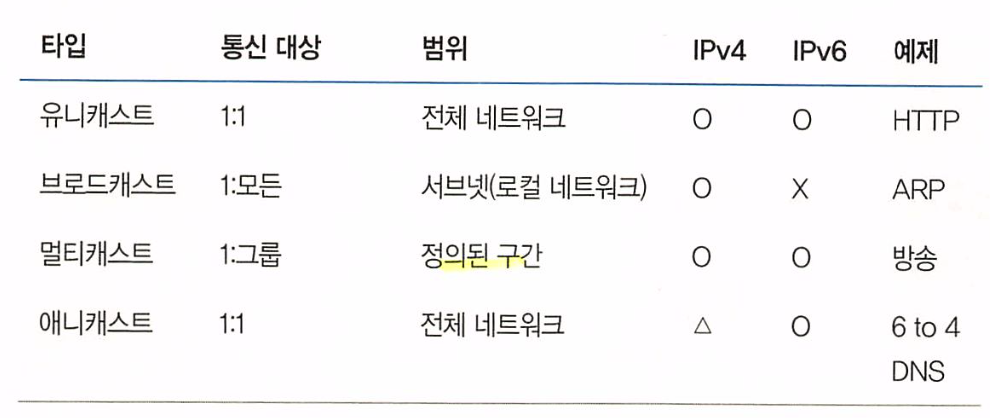
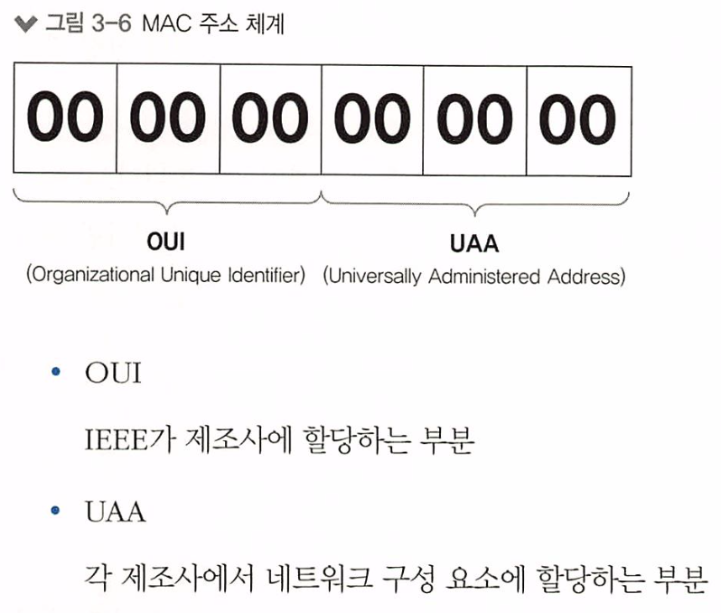
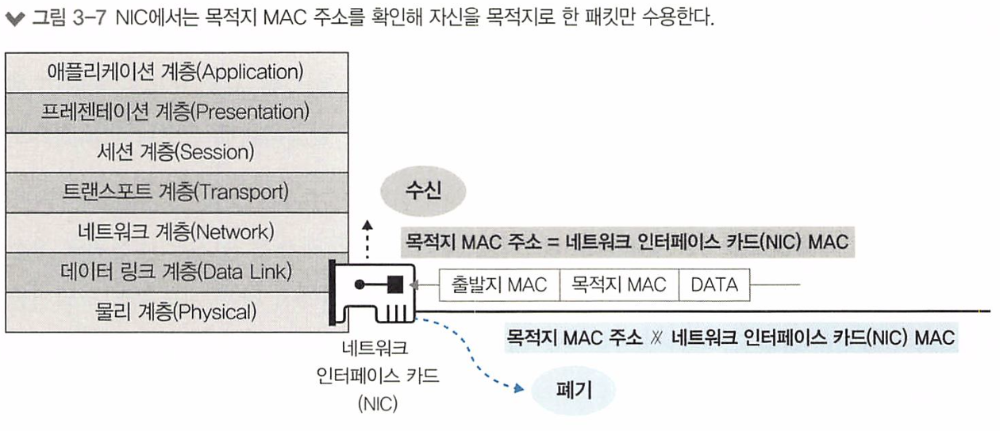
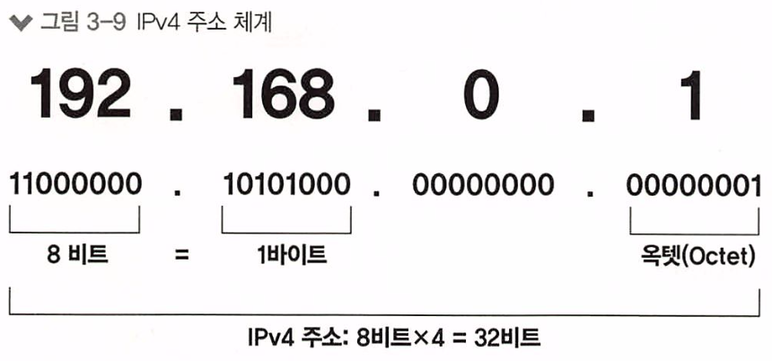
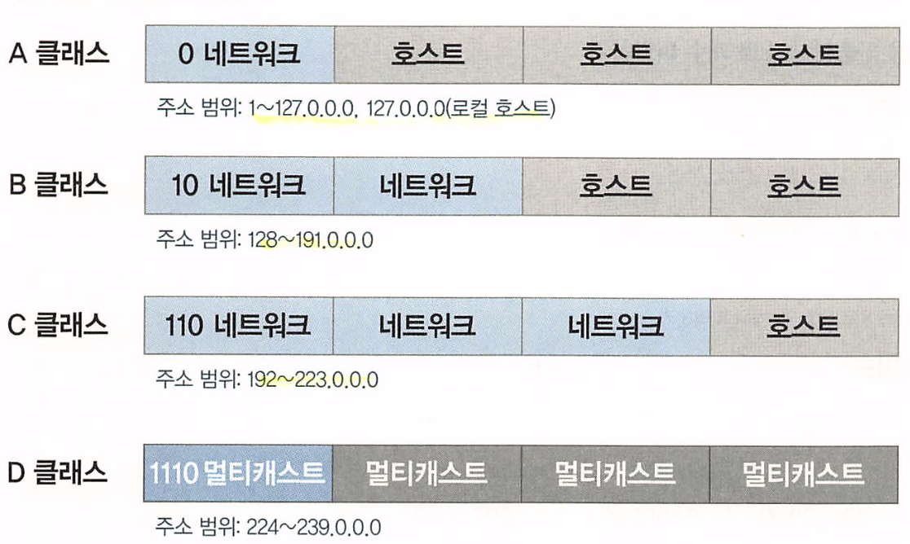

# 네트워크 통신하기

## 네트워크 전송 방식

출발지에서 목적지로 데이터를 전송할 때 사용하는 통신방식 4가지

- 유니캐스트
- 브로드캐스트
- 멀티캐스트
- 애니캐스트

#### 유니캐스트

- 출발지와 목적지가 하나로 정해져 있는 **1:1 통신 방식**
- 대부분의 통신은 유니캐스트 방식
- 도착지 기준 MAC 주소가 자신의 것과 다르면 버리기 때문에 CPU 성능을 저하시키지 않음

#### 브로드캐스트

- 출발지는 하나지만 목적지는 All인 **1:N 통신 방식**
- 유니캐스트로 통신하기 전, **상대방의 정확한 위치를 알기 위해 사용**
- 도착지 노드들에서 모두 데이터를 받기 때문에 CPU 성능을 저하시킬 수 있음

#### 멀티캐스트

- 그룹 주소를 이용해 해당 **그룹에 속한 다수의 호스트**로 패킷을 전송하는 통신 방식
- 브로드캐스트의 단점인 모든 노드에 보내 CPU 성능을 저하시키는 것을 보완해 그룹 지정 후 그룹으로만 전송

#### 애니캐스트

- **애니캐스트 주소**가 같은 호스트들 중에서 **가장 가깝거나 효율적으로 서비스할 수 있는 호스트와 통신**하는 방식
- **가장 가까운** DNS 서버를 찾거나 **가장 가까운** 게이트웨이를 찾을 때 사용
- 트래픽 분산, 네트워크 이중화, DDos 공격에 대해 서버가 받는 피해 최소화, Client와 Server 간의 물리적 거리를 최소화하여 Response Time 개선 등에 사용함

## MAC 주소

> MAC 주소란 "2계층에서 통신을 위해 네트워크 인터페이스에 할당된 고유 식별자"
>
> 네트워크에 접속하는 모든 장비는 MAC 주소라는 물리적인 주소가 있어야 하고 이 주소를 이용해 서로 통신

### MAC 주소 체계

- 고정되어 출하되며 서로 중복되지 않음

- 단, 중복되지 않을 수도 있는데 그럴 가능성은 높지 않음

  

### MAC 주소 동작

1. 전기 신호가 들어오면 2계층에서 데이터 형태(패킷)로 변환하여 내용을 구분한 후 MAC 주소 확인
2. 도착지 MAC 주소가 자신의 MAC 주소와 다르다면 폐기하고 일치하면 상위 계층으로 전달

## IP 주소

- 사용자가 변경 가능한 논리 주소
- 주소에 레벨이 있어 네트워크 주소와 호스트 주소로 나뉨

### IP 주소 체계

8bit 단위(옥텟)로 '.'으로 구분하며 아래 예시 이미지와 같음

`네트워크 주소` : 호스트들을 모아놓은 네트워크를 지칭

`호스트 주소` : 하나의 네트워크 내에 존재하는 호스트를 구분하기 위한 주소

> 네트워크들을 어떻게 구분할까?
>
> 네트워크를 무분별하게 사용할 수 없으니 이 주소를 체계적으로(크기 별) 구분하여 사용하고자 나온 개념이 Classful!

#### Classful

연속된 네트워크 주소를 할당받기 어렵다는 단점을 극복하기 위해 클래스로 네트워크를 구분하는 방법

A클래스의 경우 맨 앞의 8bit를 제외한 나머지 24bit(3Byte) 만큼의 공간을 호스트가 할당받을 수 있는 공간으로 가장 큰 단위

B, C 클래스로 향할수록 호스트가 할당 받을 수 있는 양은 줄어들지만, 작은 규모의 회사 등 네트워크 할당량이 적어도 되는 곳에서 효율적으로 사용할 수 있음

#### Classless

Classful의 경우 클래스마다 사이즈가 정해져있어 고정적이므로 더 효율적인 방안의 필요성을 느낌

이에 대해 3가지 보존, 전환 전략을 수립했음

- 단기 대책 : Classless
- 중기 대책 : NAT, 사설 IP 주소
- 장기 대책 : IPv6 전환

이 중, 단기 대책인 Classless는 CIDR을 사용해 서브 네트워킹을 할 수 있어 Classful 보다 유동적으로 서브네팅할 수 있음

### 서브네팅

Classless에서 사용하며 기존 Classful 단위에서의 네트워크를 더 잘게 잘라 소규모, 여러 개의 네트워크로 만드는 작업

이 때, 주의할 점은 서브네팅된 네트워크의 맨 앞 주소는 **네트워크의 주소**, 맨 뒤 주소는 **브로드캐스팅 주소**로 사용자에게 할당될 수 있는 주소는 이 2가지 주소를 제외한 나머지 부분임

### 공인 IP와 사설 IP

인터넷에 접속하기 위해서는 IP 주소가 있어야 하고 전 세계에서 유일해야 하는 식별자

하지만, 사람들이 많은 디바이스를 가지고 있고 현재의 구조상에서는 모든 사람들의 디바이스 별 IP 주소를 할당할 수 없음

이 문제를 해결하기 위해 가상 IP인 NAT 네트워크를 사용한 사설 IP 개념이 등장함

사설 IP를 할당 받은 사용자는 본인의 NAT 네트워크 상의 게이트웨이를 통해 공인 IP로 변환되어 인터넷 망으로 데이터를 전송할 수 있음

> 주의할 점 : 사설 IP 주소는 클래스 별로 예약된 주소가 있는데 이 주소를 사용하지 않을 경우 공인 IP 주소와 일치하는 경우가 생겨 실제 겹치는 공인 IP로의 전송이 불가능해지는 문제가 발생할 수 있음!!
>
> 그러니, 사설 IP는 얌전하게 사설 IP로 예약된 주소를 사용하자!

