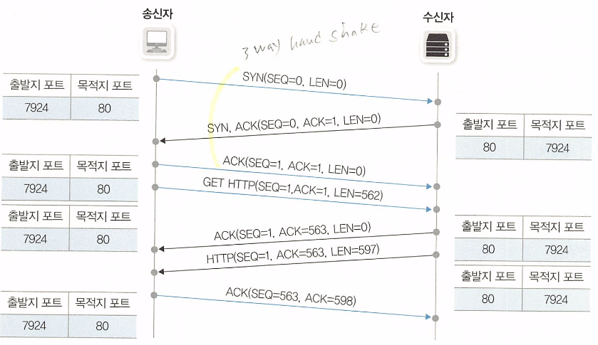
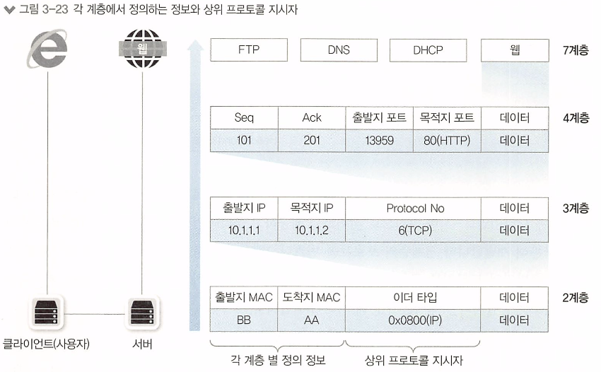
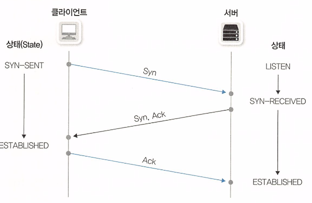
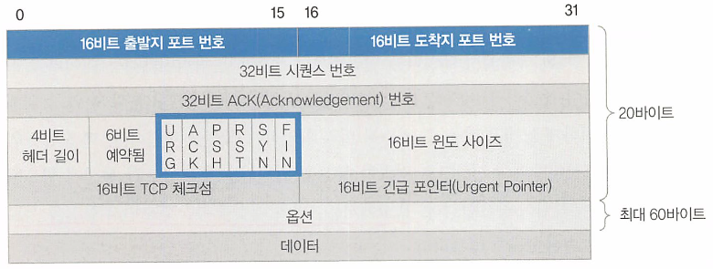

# 네트워크 통신하기

## TCP와 UDP

- 4계층의 목적
  - 목적지 단말 안에서 동작하는 여러 애플리케이션 프로세스 중 통신해야 할 목적지 프로세스를 찾아가기
  - 패킷 순서가 바뀌지 않도록 잘 조합해 원래 데이터를 잘 만들어내기

### 4계층 프로토콜(TCP, UDP)과 서비스 포트

- 송신부에서는 7 -> 1계층으로 내려갈수록 데이터를 인캡슐레이션, 수신부에서는 역으로 디캡슐레이션을 진행해 데이터를 수신

- 이 과정에서 각 계층별로 중요한 정보들을 헤더에 넣게 됨

  - 각 계층에서 정의하는 정보들
  - 상위 프로토콜 지시자 정보

  

- 송신부의 각 계층에서 추가한 정보는 수신부의 동일 계층에서 확인할 수 있음

- 상위 프로토콜 지시자는 디캡슐레이션 과정에서 상위 계층의 프로토콜이나 프로세스가 무엇인지 찾기 위한 목적으로 사용

- 결국 4계층의 목적은 데이터를 수신한 뒤 순서에 맞게 재조합하는 것이기 때문에 시퀀스 넘버(Seq)와 ACK 번호를 사용

### TCP

- 신뢰할 수 없는 공용망에서도 정보유실 없는 통신을 보장하기 위해 **세션을 안전하게 연결**하고 데이터를 분할하고 **분할된 패킷들이 잘 전송되었는지 확인**

  `패킷 순서, 응답 번호`

  - 수신 측에서 패킷들을 잘 조합하기 위해 패킷에 순서를 부여하는 것을 **시퀀스 번호**, 응답에 대해 번호를 부여하는 것을 **ACK 번호**라고 함

    

  - 송신부와 수신부는 서로 SEQ 번호와 ACK 번호를 주고 받으며 통신

  `윈도 사이즈, 슬라이딩 윈도`

  - TCP는 일방적으로 패킷을 보내는 것이 아니라 수신부가 잘 받았는지 확인하기 위해 ACK 번호를 받고 다음 패킷을 전송
  - 송,수신자 간의 거리가 멀 경우 패킷을 1개씩 전송하는 방식은 RTT(왕복 지연 시간)을 증가시킴
    - 많은 패킷을 한꺼번에 보내고 이에 대한 응답을 하나만 받는 방식인 슬라이딩 윈도 방식으로 개선
    - 이 때 한 번에 보내는 패킷의 개수는 윈도 사이즈에 의해 결정되며 TCP 데이터 유실이 발생하면 윈도 사이즈를 줄이고 다시 늘려가며 개선

  `3-way 핸드셰이크`

  - TCP에서는 유실 없는 안전한 통신을 위해 통신 시작 전에 사전 연결 작업을 진행함

  - 통신 전에 데이터를 안전하게 주고받을 수 있는지 미리 확인하는 작업으로 통신에 필요한 리소스들을 미리 확보함

    

  - 3-way 핸드셰이크는 엄밀히 말하면 데이터 전송과는 목적이 다르므로 패킷을 구분해야 함

    - 헤더에 플래그라는 값을 넣어 핸드셰이크 진행

    

    `SYN` : 연결 시작 용도

    `ACK` : ACK 번호가 유효할 경우 실어 보냄

    `FIN` : 연결 종료 + 데이터 전송 마치고 정상적으로 양방향 종료 시 사용

    `RST` : 연결 종료 + 연결 강제 종료를 위해 연결을 일방적으로 끊을 때 사용

    `URG` : 긴급 데이터

    `PSH` : 서버 측에서 전송할 데이터가 없거나 데이터를 버퍼링 없이 응용 프로그램으로 즉시 전달할 것을 지시할 때 사용

  - 플래그와 SEQ, ACK 번호는 별개의 의미임, 혼동하지 말자.

### UDP

- TCP에서 패킷 유실을 막기 위해 사용했던 방법들(3-way 핸드셰이크 + 버퍼링)을 UDP에서는 수행하지 않음
- `UDP의 목적`
  - 음성 데이터나 실시간 스트리밍 같은 **시간에 민감한 프로토콜이나 애플리케이션**을 사용하는 경우
  - 멀티캐스트로 단방향으로 **다수의 단말과 통신해 응답을 받기 어려운** 경우

## ARP

- 원격지로 ARP를 보낼 때 어떻게 이뤄지는가? 에 대한 답 링크

​		https://m.blog.naver.com/PostView.naver?isHttpsRedirect=true&blogId=voice45&logNo=80205508433

- 실제 통신은 IP 기반으로 일어나고 MAC 주소는 상대방의 MAC 주소를 자동으로 알아내 통신하게 됨
  - 상대방의 MAC 주소를 알아내기 위해 사용되는 프로토콜이 ARP
- 호스트에서 기존에 아무런 통신이 없다가 처음 통신을 시도하면 목적지에 대한 MAC 주소를 모르기 때문에 2계층 캡슐화를 할 수가 없어 전송 불가
  - 이를 위해 ARP를 사용해 목적지의 MAC 주소를 얻어낸 후 통신 가능함
- 각 노드는 패킷들을 전송하는데 전송할 때마다 ARP를 사용해 MAC 주소를 얻어오면 성능이 떨어지므로 ARP 테이블을 유지

`GARP`

- 자신의 IP와 MAC 주소를 알릴 목적으로 사용됨
- 자신의 IP와 MAC 주소를 알리는 이유?
  - IP 주소 충돌 감지
  - 동일 서브넷 상의 다른 노드의 ARP 테이블 갱신
  - HA 용도의 클러스터링, VRRP ,HSRP

`RARP`

- Reverse ARP
- IP 주소가 정해지지 않은 단말이 IP 할당을 요청할 때 사용됨
- 자신의 MAC 주소는 있지만 IP를 할당되지 않아 IP를 할당해주는 서버에 어떤 IP 주소를 써야 하는지 물어볼 때 사용

## 서브넷과 게이트웨이

- 초기에는 LAN 네트워크만 고려하여 설계되었어서 통신하는 방법이 간단했으나 LAN 간의 통신이 중요해짐
- 원격지 네트워크와의 통신에 사용하는 장비를 게이트웨이라고 부르고 3계층 장비인 라우터와 L3 스위치가 이 역할을 할 수 있음

### 서브넷과 게이트웨이의 용도

- 원격 네트워크 통신은 네트워크를 넘어서까지 전달하지 못하는 브로드캐스트의 성질 때문에 ARP로 MAC 주소를 얻을 수 없고 네트워크 장비(게이트웨이)의 도움이 필요함
- 동일 서브넷에서의 통신이라면 단순히 ARP를 사용하여 통신할 수 있게되지만 원격지면 말이 달라지기 때문에 동일 서브넷인지 확인하는 작업이 선행되어야 함

